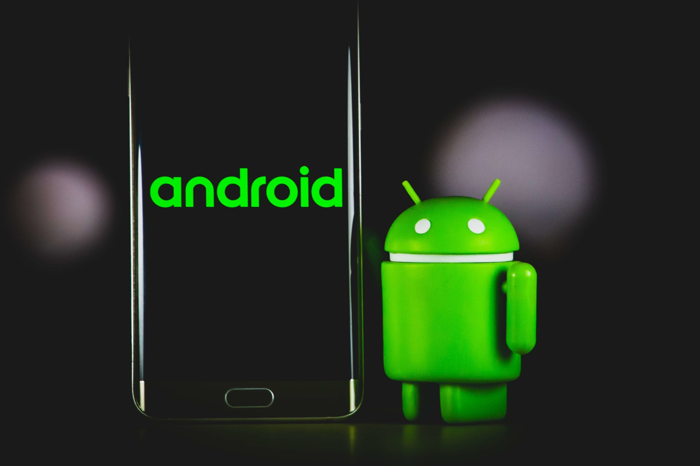
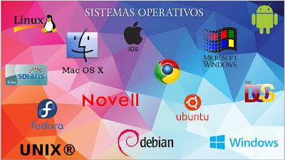
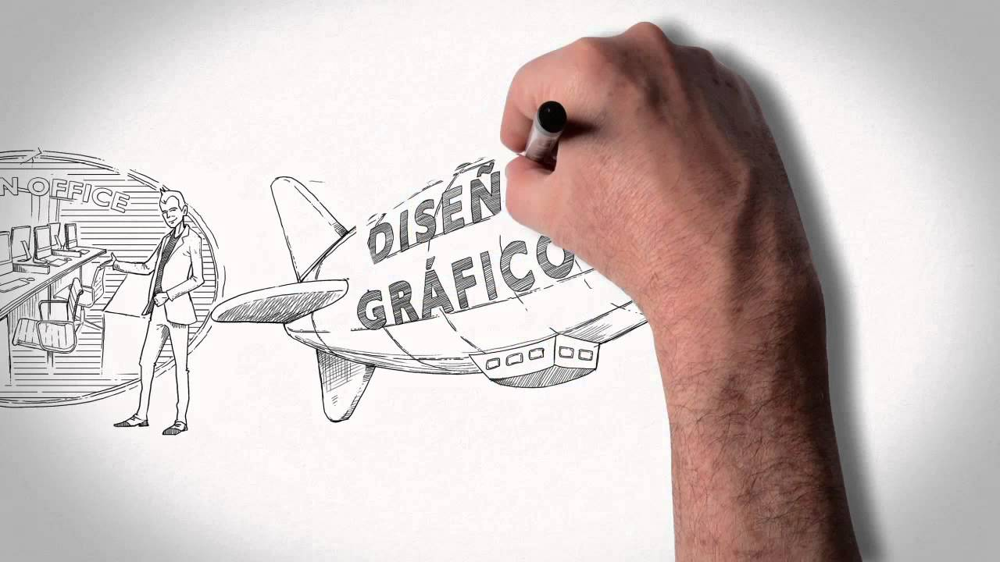

# Practica 6
## Victor Gabriel Bojorges Hermosillo
### Proyecto de App
#### Fernando Garcia (Mosby)
Desarrollo de un videojuego movil en android con bases en 3d 

### Sistemas Operativos
#### Aldices Albora 
Investigacion y aprendizaje de sistemas operativos y componentes

### Principios de Composicion y Diseño
#### Ana Chaparro 
Aprender conceptos basicos y avanzados sobre diseño grafico y aplicarlos
