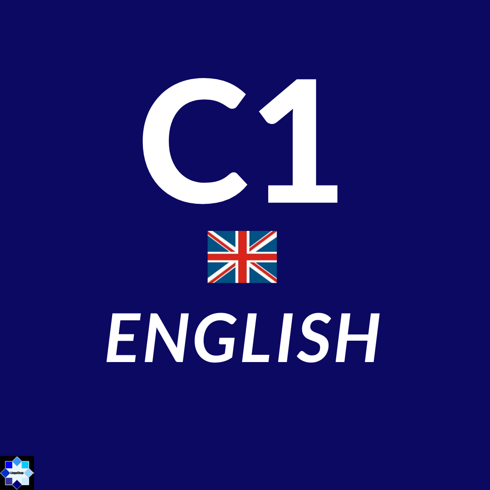

# Practica 6
## Victor Gabriel Bojorges Hermosillo
### Proyecto de App
#### Fernando Garcia (Mosby)
Desarrollo de un videojuego movil en android con bases en 3d 

### Sistemas Operativos
#### Aldices Albora 
Investigacion y aprendizaje de sistemas operativos y componentes

### Principios de Composicion y Diseño
#### Ana Chaparro 
Aprender conceptos basicos y avanzados sobre diseño grafico y aplicarlos

### Programación en Lenguajes Interpretados
#### Jonathan Mircha
Aprender y implementar conceptos de programación en programas como git, github, java, Html5.

### Inglés C1
#### Jorge Oropeza
Conceptos avanzados de Inglés y con aplicacion para el mundo laboral

### Diseño de Videojuegos
#### Ana Guadalupe Olivar
Aprender conceptos de programación y diseño en videojuegos en programas como unity
